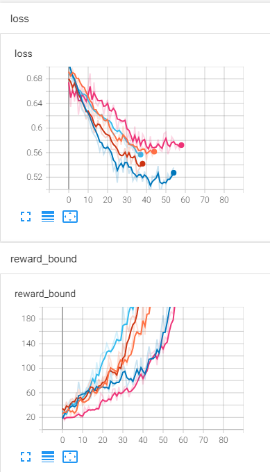
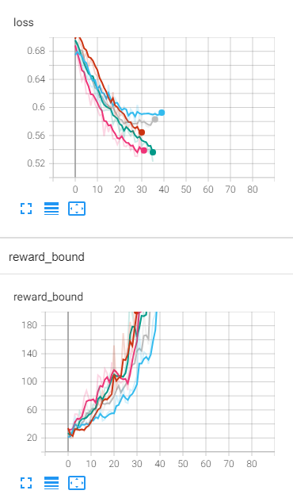
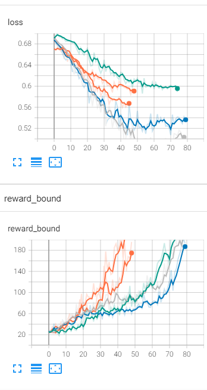

# Отчет 1. Исследование метода кросс-энтропии в среде Cartpole 

## 1. Число скрытых нейронов (2 балла)
При начальном значении `hidden_state=64` сходимость достигается в среднем за 47 итераций (от 36 до 58).
Графики функции потерь и среднего вознаграждения приведены ниже. 




При увеличении значения `hidden_state=128` сходимость достигается в среднем за 35 итераций (от 30 до 40).  
Графики функции потерь и среднего вознаграждения приведены ниже. 


<

При уменьшении значения `hidden_state=32` сходимость достигается в среднем за 62 итераций (от 44 до 80).
Графики функции потерь и среднего вознаграждения приведены ниже. 




## 2. Архитектура нейросети (3 балла)
Начальная архитектура имеет следующий вид: 
```
nn.Linear(obs_size, hidden_size),
nn.ReLU(),
nn.Linear(hidden_size, n_actions)
nn.ReLU()
nn.Linear(hidden_size, n_actions)
```
Значение `hidden_size=64`. 
Для этой архитектуры сходимость достигается в среднем за 53 итераций  
Данный показатель сходимости является ниже, нежели, чем при одном скрытым слое.
Можно сделать вывод, что увеличение числа скрытых сильно влияет на скорость сходимости агента. 
Графики функции потерь и среднего вознаграждения приведены ниже. 


## 3. Видео отчет (2 балла)
Лучший результат показала архитектура, которая имеет следующий вид: 
```
nn.Linear(obs_size, hidden_size),
nn.ReLU(),
nn.Linear(hidden_size, n_actions)
```
Значение `hidden_size=64`. 
Для этой архитектуры сходимость достигается в среднем за 53 итераций (от 22 до 75). 
Видео с примером работы агента приведено ниже.  

Видео
<video src="video/rl-video-episode-0.mp4" width="240"/>
