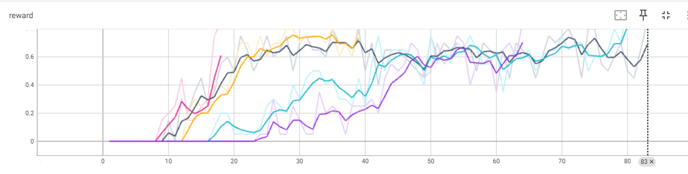
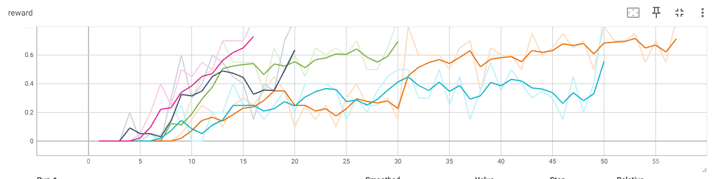
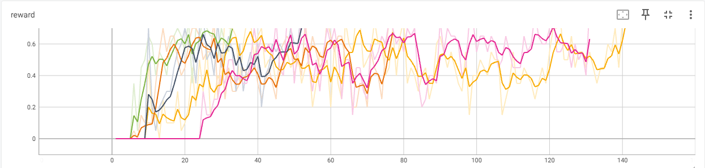
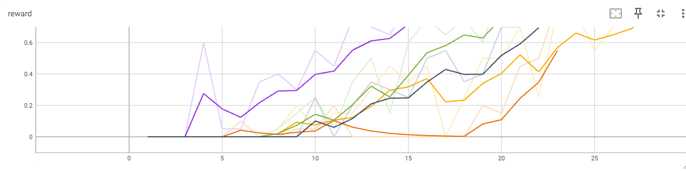
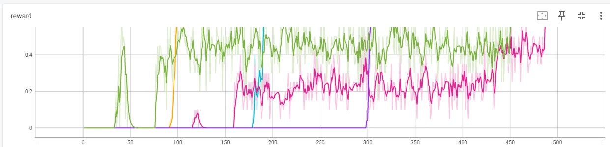
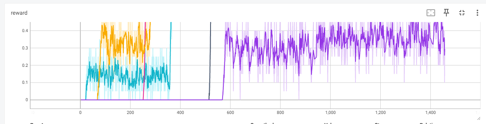

# Отчет 2. Исследование метода Q-learning в среде Frozen Lake 

## 1. Сравнение алгоритмов V и Q learning (2 балла)
Для алгоритма `V learning` на поле (4х4) при `gamma=0.9` сходимость (mean reward > 0.85) достигается в среднем за 67 итерации (от 16 до 83). 
Графики зависимости reward от количества итераций приведены ниже. 

Для алгоритма `Q learning` на поле (4х4) при `gamma=0.9` сходимость (mean reward > 0.85) достигается в среднем за 40 итерации (от 16 до 56). 
Графики зависимости reward от количества итераций приведены ниже. 

**Вывод:** У алгоритма V learning сходиомсть достигается за 67 иттераций,

у алгоритма Q learning сходимость достгиается

## 2. Влияние гиперпараметра `GAMMA` на скорость сходимости . (2 балла)

Для алгоритма `Q learning` на поле (4х4) при `gamma=0.8` сходимость (mean reward > 0.85) достигается в среднем за 53 итерации (от 26 до 140). 
Графики зависимости reward от количества итераций приведены ниже. 3 fdde

**Вывод:** Увеличение гиперпараметра `GAMMA` приводит к уменьшению итераций Это связано с тем, что ...   

Уменьшение гиперпараметра `GAMMA` приводит к тому что сходимость уменьшается Это связано с тем, что ... 

**Вывод:** Увеличение гиперпараметра `GAMMA` приводит к более быстрой сходимости  Это связано с тем, что ...   

Уменьшение гиперпараметра `GAMMA` приводит к тому что сходимость уменьшается Это связано с тем, что ... 

## 3. Сравнение алгоритмов V и Q learning на поле большего размера (3 балла)

Для алгоритма Q learning на поле (8х8) при gamma=0.9 сходимость (mean reward > 0.9) достигается в

среднем за 120 итераций (от 22 до 142). Графики зависимости reward от количества итераций приведены ниже.

Для алгоритма V learning на поле (8х8) при gamma=0.9 сходимость (mean reward > 0.85) достигается в

среднем за 870 итераций (от 580 до 1 450). Графики зависимости reward от количества итераций приведены ниже.

**Вывод:**
: В итоге наблюдается существенное увеличение количетсва итераций, и,

соответственно времени, требуемого на обучение модели. 
Увеличение гиперпараметра `GAMMA` приводит к более быстрой сходимости  Это связано с тем, что Гамма отвечает за то

насколько наш агент будет жадным, уменьшая гамма -мы делаем агента более жадным, в связи с чем ему требуется времени и наоборот   

