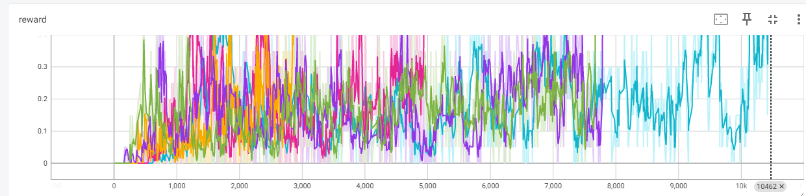
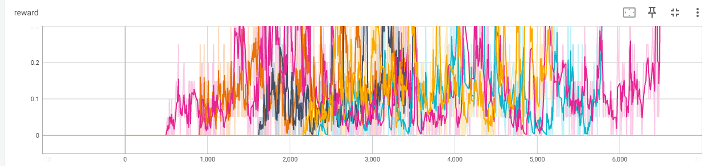
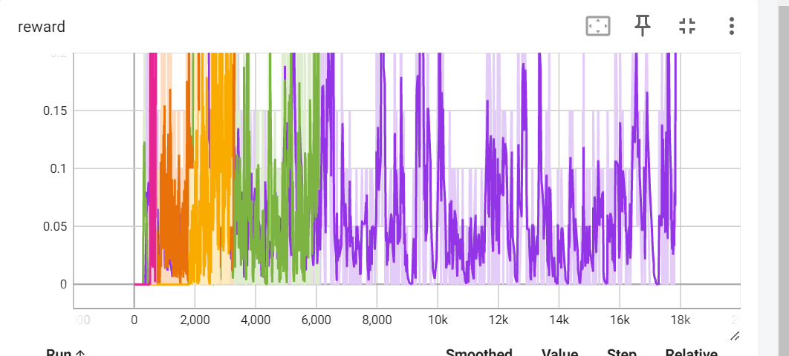

# Отчет 3. Исследование метода Q-learning в среде Frozen Lake 

## 1. Сравнение c изменением параметра альфы

Для алгоритма `V learning` на поле (4х4) при `alpha=0.2` сходимость (mean reward > 0.85) достигается в среднем за 9442 итерации (от 1020 до 10462). 
Графики зависимости reward от количества итераций приведены ниже. 

Для алгоритма `Q learning` на поле (4х4) при `alpha=0.5` сходимость (mean reward > 0.85) достигается в среднем за 4300 итерации (от 2200 до 6500). 
Графики зависимости reward от количества итераций приведены ниже. 

Для алгоритма `Q learning` на поле (4х4) при `alpha=1` сходимость (mean reward > 0.85) достигается в среднем за 15800 итерации (от 2100 до 17900). 
Графики зависимости reward от количества итераций приведены ниже. 

**Вывод:** Алгоритм обучения ценности состояний более эффективен чем обучение ценности действий. Это связано с тем, что 

гиперпараметр alpha сильно влияет на скорость обучения модели. Не трудно заметить, что если alpha стремится к нулю, то

начинаются проблемы в обучении модели: обучение сильно замедляется или становится невозможным вследствии локальных минимумов.

№2 Мы обучили алгоритм и получили следующий результат: Total reward: -6.00. 

На видео видно, как модель практически одну минуту справляется с игрой. 

Данный результат не является лучшим из возможных, но наш агент хорошо справляется 

с задачей.

№3 Будет изменен гипермараметр batch_size с 32 до 16 объектов и посмотрим как поведет себя агент в таких условиях. 