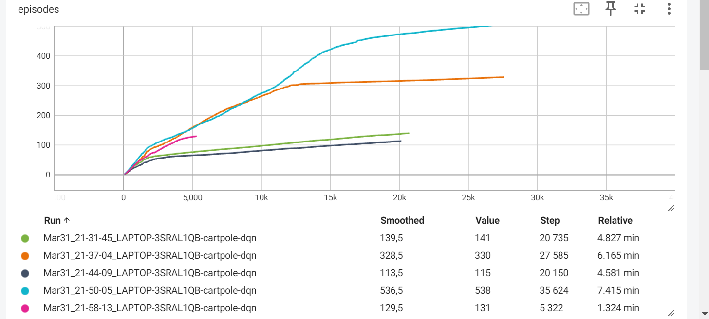
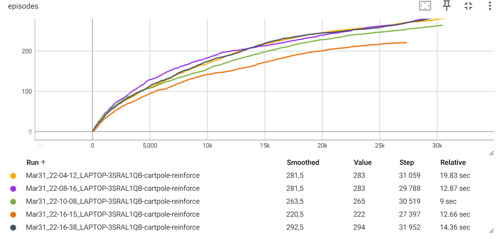

## Отчет 4. REINFORCE and Actor-Critic methods

## 1. Изучите модификации алгоритма глубокого обучения (Deep Q learning) в среде Cartpole: Chapter11/01_cartpole_dqn.py

Для алгоритма Deep Q learning в среде Cartpole при гиперпараметрах gamma=0.99 и LEARNING_RATE=0.01 сходимость (mean reward > 0.9) достигается в среднем за 26 255 итераций (от 20 612 до 31 908). 

Графики зависимости reward от количества итераций приведены ниже.

## 2. Изучите алгоритм REINFORCE Chapter11/02_cartpole_reinforce.py. Исследуйте влияние гиперпараметров на среднее количество шагов сходимости.(3)

Для алгоритма 02_cartpole_reinforce в среде Cartpole gamma=0.99, LEARNING_RATE=0.01 и EPISODES_TO_TRAIN = 4 сходимость достигается в среднем за 37 701 итераций (от 27 164 до 48 329). 

Графики зависимости reward от количества итераций приведены ниже.

Для алгоритма Deep Q learning в среде Cartpole gamma=0.99, LEARNING_RATE=0.01 и EPISODES_TO_TRAIN = 8 сходимость достигается в среднем за 30 870 итераций (от 29 788 до 31 952). 

Графики зависимости reward от количества итераций приведены ниже.

