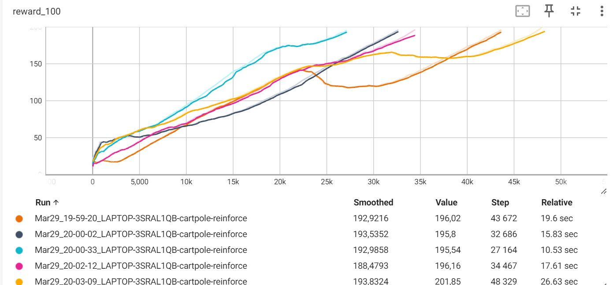

## Отчет 4. REINFORCE and Actor-Critic methods

## 1. Изучите модификации алгоритма глубокого обучения (Deep Q learning) в среде Cartpole: Chapter11/01_cartpole_dqn.py

## 2. Изучите алгоритм REINFORCE Chapter11/02_cartpole_reinforce.py. Исследуйте влияние гиперпараметров на среднее количество шагов сходимости.(3)

Для алгоритма Deep Q learning в среде Cartpole при гиперпараметрах gamma=0.99 и LEARNING_RATE=0.01 сходимость (mean reward > 0.9) достигается в среднем за 26 255 итераций (от 20 612 до 31 908). 

Графики зависимости reward от количества итераций приведены ниже.

